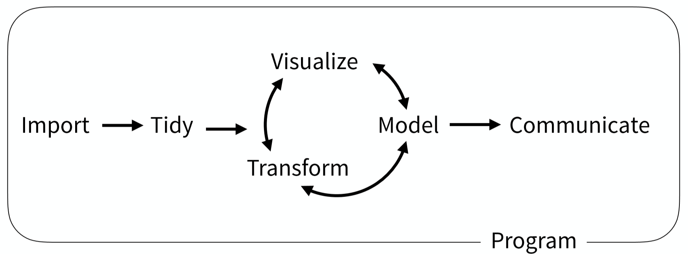
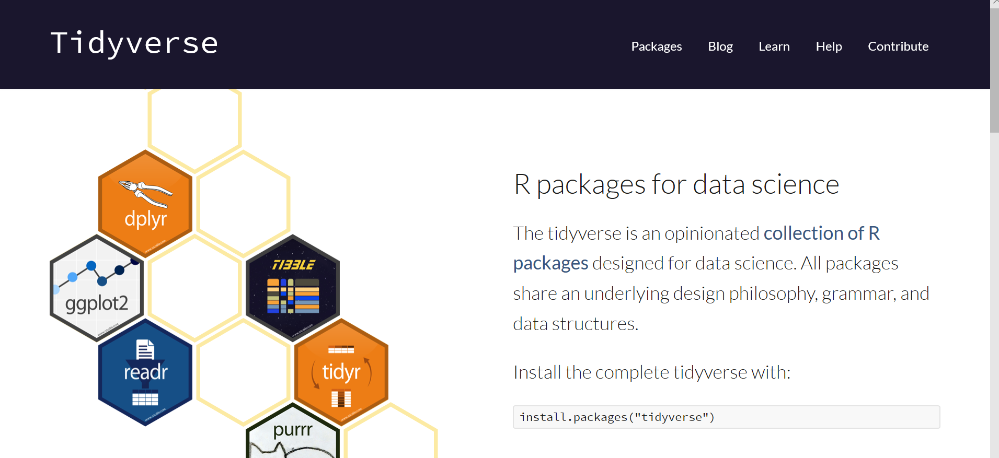
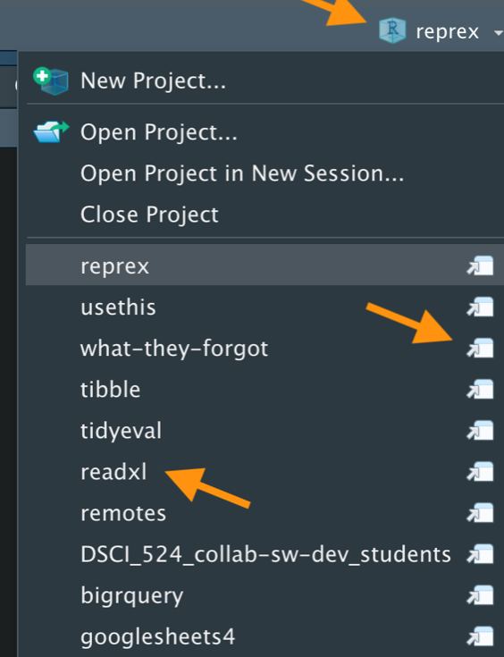
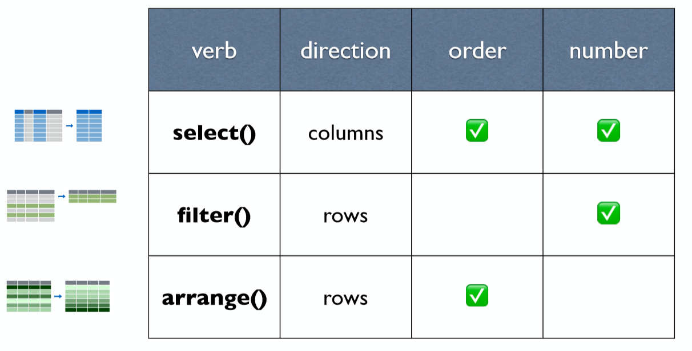
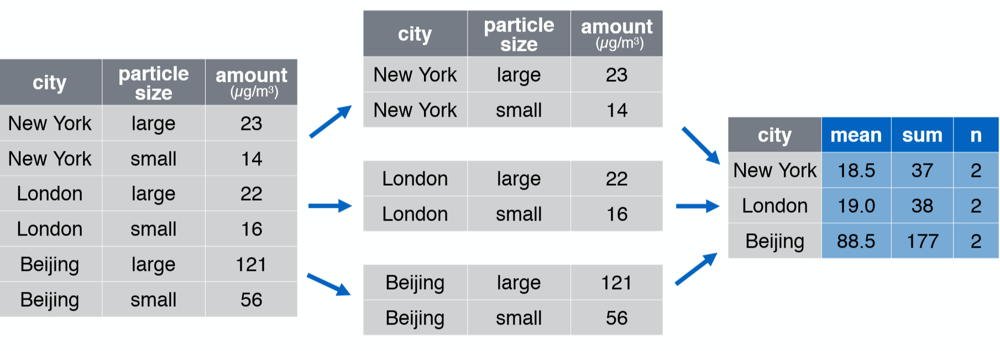
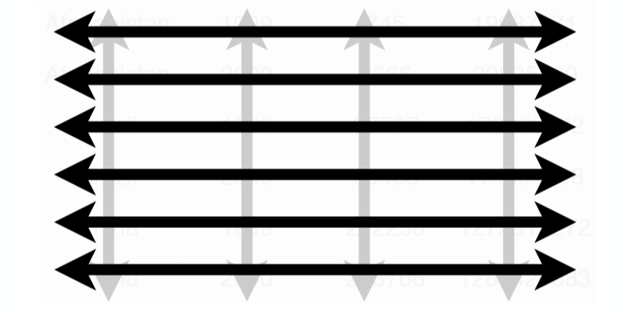

```{r, include=FALSE}
knitr::opts_chunk$set(
  collapse = TRUE,
  message = FALSE,
  warning = FALSE
)
```


```{r delete-me, include = FALSE}
# devtools::install_github("ropenscilabs/icon")
# devtools::install_github("gadenbuie/countdown")
# devtools::install_github("hadley/emo")
library(countdown)
library(knitr)
library(tidyverse)
library(janitor)
library(readxl)
```
class: title-slide, center

<span class="fa-stack fa-4x">
  <i class="fa fa-circle fa-stack-2x" style="color: #ffffff;"></i>
  <strong class="fa-stack-1x" style="color:#E7553C;">`r rmarkdown::metadata$session`</strong>
</span> 

# `r rmarkdown::metadata$title`

## `r rmarkdown::metadata$subtitle`

### `r rmarkdown::metadata$author`

#### `r params$site_link`
---
layout: true

<div class="my-footer"><span>`r params$site_link`</span></div>

---

# Getting Started

You will learn the basics of `r icon::fa("r-project")` and data science, and practice using the RStudio IDE (integrated development environment). We'll discuss about data transformation and tidying with **dplyr** and **tidyr**.

If you want to transition from coding in base R to the **tidyverse**, or just jump into doing data science in the tidyverse without any prior R experience.

Here we will work on the first steps!

---

## Prework

You may need to install the following:
 
1. A recent version of R (~3.6.3), which is available for free at [cran.r-project.org](http://www.cran.r-project.org)

2. A recent version of RStudio IDE (~1.2.5033), available for free at [www.rstudio.com/download](http://www.rstudio.com/download).

---

## Prework

3. The set of relevant R packages, which you can install by connecting to the internet, opening RStudio, and running:  
 
```{r instal, eval=FALSE}
 
packages <- c("tidyverse", "janitor", "skimr",
              "here", "writexl",  "readxl",  
              "cowplot", "patchwork", "RColorBrewer",
              "learnr") 

install.packages(packages)

```

---

# Using packages

.pull-left[
## 1 
```{r echo=TRUE, eval=FALSE}
install.packages("vegan")
```
Download files

One time per computer

] 
.pull-right[
## 2

```{r eval=FALSE, echo=TRUE}
library(vegan)
```
In each session

]

---
class: inverse

# Your Turn


```{r echo=FALSE}
countdown(minutes = 2)
```

---

class: middle, center

.left-narrow[

## R for Data Science

### [English version](http://r4ds.had.co.nz/) 

### [Spanish traslation](https://es.r4ds.hadley.nz/)

]

.right-wide[

```{r echo=FALSE, fig.align='center', out.width='50%'}
knitr::include_graphics("images/cover.png")
```
]

---

## Data science workflow

```{r echo=FALSE, fig.align='center', out.width='80%'}

```

---

## Data science workflow

```{r echo=FALSE, fig.align='center', out.width='65%'}
knitr::include_graphics("images/horst-eco-r4ds-env-only.png")
```
##### by [Allison Horst](https://github.com/allisonhorst/stats-illustrations)

---

## Data science workflow

```{r echo=FALSE, fig.align='center', out.width='65%'}
knitr::include_graphics("images/horst-eco-r4ds-env-comm-only.png")
```
##### by [Allison Horst](https://github.com/allisonhorst/stats-illustrations)

---

## Data science workflow

```{r echo=FALSE, fig.align='center', out.width='65%'}
knitr::include_graphics("images/horst-eco-r4ds.png")
```
##### by [Allison Horst](https://github.com/allisonhorst/stats-illustrations)

---

# [tidyverse.org](https://www.tidyverse.org/)

```{r echo=FALSE, fig.align='center', out.width='65%'}

```

---

class: middle, center

##  RStudio Projects

.left-narrow[

Keeping all the files associated with a project organized together – input data, R scripts, results and figures.

]

.right-wide[

```{r echo=FALSE, fig.align='center', out.width='50%'}

```
]
---

## **here()**. A simpler way to find your files.

```{r echo=FALSE, fig.align='center', out.width='50%'}
knitr::include_graphics("https://raw.githubusercontent.com/allisonhorst/stats-illustrations/master/rstats-artwork/here.png")
```


##### by [Allison Horst](https://github.com/allisonhorst/stats-illustrations)


---

class: center

##  Import data

.pull-left[

```{r echo=FALSE, fig.align='center', out.width='45%'}
knitr::include_graphics("images/readr.png")
```

```{r eval=FALSE}
library(readr)
read_csv(".../")
read_tsv(".../")
read_delim(".../")
```

]

.pull-right[

```{r echo=FALSE, fig.align='center', out.width='45%'}
knitr::include_graphics("images/readxl.png")
```

```{r  eval=FALSE}
library(readxl)
read_xls(".../")
read_xlsx(".../")
```

]


---

## Import data

```{r echo=TRUE, warning=FALSE}
chem_trait <- read_csv("data/PFTC1.2_China_2015_2016_ChemicalTraits.csv")
```
```{r echo=TRUE}
chem_trait %>% 
  names()
```

---

# The pipe operator

Passes result on left into first argument of function on right.

```{r echo=FALSE, fig.align='center', out.width='30%'}
knitr::include_graphics("images/pipe.png")
```
```{r eval=FALSE}
clean_names(chem_trait)

chem_trait %>% 
  clean_names()

```


---

## **janitor::clean_names()**.

```{r echo=FALSE}
chem_trait <- read_csv("data/PFTC1.2_China_2015_2016_ChemicalTraits.csv") %>%  
  clean_names()
```


```{r echo=TRUE, eval=FALSE}
chem_trait <- read_csv("data/PFTC1.2_China_2015_2016_ChemicalTraits.csv") %>%  
  clean_names()
```
```{r echo=TRUE}
chem_trait %>% 
  names()
```

---
class: inverse

# Your Turn


```{r echo=FALSE}
countdown(minutes = 1)
```

---

class: inverse

## dplyr

.pull-left[
```{r echo=FALSE, fig.align='center', out.width='70%'}
knitr::include_graphics("images/dplyr.png")
```
]

.pull-right[
A package that transforms data. **dplyr** implements a grammar for transforming tabular data.
]

---

# Isolating data

```{r echo=FALSE, fig.align='center', out.width='70%'}

```

---

## select()

```{r eval=FALSE}
chem_trait
```
```{r echo=FALSE}
chem_trait 
```

---

## select() - Extract columns by name.

```{r eval=FALSE}
chem_trait %>% 
  select(date, site, taxon)
```

```{r echo=FALSE}
chem_trait %>% 
  select(date, site, taxon) 
```


---

## select() - Select every column but

```{r eval=FALSE}
chem_trait %>% 
  select(-c(date, elevation, site))
```

```{r echo=FALSE}
chem_trait %>% 
  select(-c(date, elevation, site)) 
```

---

## select() - Rename variables

.pull-left[

```{r eval=FALSE}
chem_trait %>% 
  select( date, site)
```

```{r echo=FALSE}
chem_trait %>% 
  select(date, site) 
```


]

.pull-right[
```{r eval=FALSE}
chem_trait %>% 
select( time = date,
        location = site)
```


```{r echo=FALSE}
chem_trait %>% 
select( time = date,
        location = site) 
```

]

---

#### select() 

**:** - select a range of columns

```{r eval=FALSE}
chem_trait %>% 
  select(date:taxon)
```

```{r echo=FALSE}
chem_trait %>% 
  select(date:taxon)
```

---

#### select() 

**start_with** - Select columns that start with...

```{r eval=FALSE}
chem_trait %>% 
  select(starts_with("cn"))
```

```{r echo=FALSE}
chem_trait %>% 
  select(starts_with("cn"))
```

---

## **filter()** - Extract rows that meet logical criteria

```{r eval=FALSE}
chem_trait %>% 
  select(treatment, taxon) %>% 
  filter(treatment == "OTC")

```

```{r echo=FALSE}
chem_trait %>% 
  select(treatment, taxon) %>% 
  filter(treatment == "OTC")
```


---

## filter( )


```{r eval=FALSE}
chem_trait %>% 
  select(treatment, taxon) %>% 
  filter(treatment == "OTC",
         taxon == "Epilobium fangii")
```

```{r echo=FALSE}
chem_trait %>% 
  select(treatment, taxon) %>% 
  filter(treatment == "OTC",
         taxon == "Epilobium fangii")
```

---

## Logical tests

|Operator| Meaning|
|:--------|:-------------|
|x < y| Less than |
|x > y| Greater than|
|x == y| Equal to|
|x <= y| Less than or equal to|
|x >= y| Greater than or equal to| 
|x != y| Not equal to |
|x %in% y| Group membership|
|is.na(x)| Is NA |
|!is.na(x)| Is not NA|

---

## Boolean operator

|Operator| Meaning|
|:--------|:--------------|
|a & b| and|
|"a|b"| or|
|!a| not |
|a %in% c(a, b)| one of (in)| 

---

### **%in%**

```{r eval=FALSE}
chem_trait %>% 
  select(site, treatment) %>% 
  filter(treatment %in% c("LOCAL", "OTC", "O"))
```

```{r echo=FALSE}
chem_trait %>% 
  select(site, treatment) %>% 
  filter(treatment %in% c("LOCAL", "OTC", "O")) %>% 
  distinct(site, treatment)
```
 
---

## arrange( )

.pull-left[
```{r}
chem_trait %>% 
  select(elevation, site)
```
]

.pull-right[
```{r}
chem_trait %>% 
  select(elevation, site) %>% 
  arrange(elevation)
```
]


---

## arrange(. , desc())

.pull-left[
```{r}
chem_trait %>% 
  select(elevation, site)
```
]

.pull-right[
```{r}
chem_trait %>% 
  select(elevation, site) %>% 
  arrange(desc(elevation))
```
]

---
class: inverse

# Your Turn


```{r echo=FALSE}
countdown(minutes = 1)
```

---

class: center, middle, inverse

## Deriving Information

`r icon::fa("sitemap")`

---

### mutate() - create new variables

```{r eval=FALSE}
chem_trait %>% 
  select(site, elevation, c_percent) %>% 
  mutate(c_percent_prop = c_percent/10)
```

```{r echo=FALSE}
chem_trait %>% 
  select(site, elevation, c_percent) %>% 
  mutate(c_percent_prop = c_percent/10)
```

---

### mutate()


```{r eval=FALSE}
chem_trait %>% 
  select(site, elevation, c_percent, p_percent) %>% 
  mutate(c_p_percent = c_percent + p_percent)
```

```{r echo=FALSE}
chem_trait %>% 
  select(site, elevation, c_percent, p_percent) %>% 
  mutate(c_p_percent = c_percent + p_percent)
```

---

## summarise() - summarize() 

```{r eval=FALSE}
chem_trait %>% 
  summarise(lowest_elev = min(elevation),
            hight_elev = max(elevation))
```

```{r echo=FALSE}
chem_trait %>% 
  summarise(lowest_elev = min(elevation),
            hight_elev = max(elevation))
```
---
## summarise()

### n(), number of observations
### n_distinct(), number of unique values

```{r eval=FALSE}
chem_trait %>% 
  summarise(n_entries = n(),
            n_treatment = n_distinct(treatment))
```

```{r echo=FALSE}
chem_trait %>% 
  summarise(n_entries = n(),
            n_treatment = n_distinct(treatment))
```

---

##  Number of species

```{r eval=FALSE}
chem_trait %>% 
  summarise(n_species = n_distinct(taxon))
```

```{r echo=FALSE}
chem_trait %>% 
  summarise(n_species = n_distinct(taxon))
```


---
class: inverse

# Your Turn


```{r echo=FALSE}
countdown(minutes = 1)
```

---

class: inverse, center, middle

# Splitting the data
`r icon::fa("project-diagram")`


---

## **group_by()** 

Takes an existing tbl and converts it into a grouped tbl where operations are performed *by group*. 

```{r echo=FALSE, fig.align='center', out.width='75%'}

```

---

#### group_by() %>% summarise()

```{r eval=FALSE}
chem_trait %>% 
  group_by(site) %>% 
  summarise(n_samples = n(),
            n_species = n_distinct(taxon),
            mean_p_percent = mean(p_percent))
```

```{r echo=FALSE}
chem_trait %>% 
  group_by(site) %>% 
  summarise(n_samples = n(),
            n_species = n_distinct(taxon),
            mean_p_percent = mean(p_percent))
```

---

#### group_by() %>% summarise()

```{r eval=FALSE}
chem_trait %>% 
  group_by(site, treatment) %>% 
  summarise(n_samples = n(),
            n_species = n_distinct(taxon),
            mean_p_percent = mean(p_percent))
```

```{r echo=FALSE}
chem_trait %>% 
  group_by(site, treatment) %>% 
  summarise(n_samples = n(),
            n_species = n_distinct(taxon),
            mean_p_percent = mean(p_percent))
```

---

```{r eval=FALSE}
chem_trait %>% 
  group_by(site) %>% 
  summarise(n_samples = n(),
            n_species = n_distinct(taxon),
            mean_p_percent = mean(p_percent),
            n_of_na = sum(is.na(p_percent)))#<<
```

```{r echo=FALSE}
chem_trait %>% 
  group_by(site) %>% 
  summarise(n_samples = n(),
            n_species = n_distinct(taxon),
            mean_p_percent = mean(p_percent),
            n_of_na = sum(is.na(p_percent)))
```

---
```{r eval=FALSE}
chem_trait %>% 
  group_by(site) %>% 
  summarise(n_samples = n(),
            n_species = n_distinct(taxon),
            mean_p_percent = mean(p_percent, na.rm = TRUE),#<<
            n_of_na = sum(is.na(p_percent)))#<<
```

```{r echo=FALSE}
chem_trait %>% 
  group_by(site) %>% 
  summarise(n_samples = n(),
            n_species = n_distinct(taxon),
            mean_p_percent = mean(p_percent, na.rm = TRUE),
            n_of_na = sum(is.na(p_percent)))
```

---

### ungroup()


```{r eval=FALSE}
chem_trait %>% 
  group_by(site) %>% 
  summarise(n_samples = n(),
            n_species = n_distinct(taxon),
            mean_p_percent = mean(p_percent, na.rm = TRUE)) %>% 
  ungroup()#<<
```

```{r echo=FALSE}
chem_trait %>% 
  group_by(site) %>% 
  summarise(n_samples = n(),
            n_species = n_distinct(taxon),
            mean_p_percent = mean(p_percent, na.rm = TRUE)) %>% 
  ungroup()
```


---
class: inverse

# Your Turn


```{r echo=FALSE}
countdown(minutes = 1)
```


---


class: inverse

## tidyr

.pull-left[
```{r echo=FALSE, fig.align='center', out.width='70%'}
knitr::include_graphics("images/tidyr.png")
```
]

.pull-right[
A package that **reshapes** the layout of tabular data.
]

---

class: center, middle, inverse

# "Data comes in many formats, but R prefers just one: **tidy data**. "  
 - Garrett Grolemund

---

# Tdidy Data

.pull-left[
A data set is **tidy** if:

1. Each variable is in its own `column`. 

2. Each case is in its own `row`. 

3. Each value is in its own `cell`.

]

.pull-right[
```{r echo=FALSE, fig.align='center', out.width='80%'}

```
]


---
class: center, middle, inverse

# "Tidy data sets are all alike; but every messy data set is messy in its own way."  

- Hadley Wickham

---

## separate()

```{r eval=FALSE}
chem_trait %>%
  select(site, taxon) %>% 
  separate(taxon, c("genus", "specie"))#<<
```

```{r echo=FALSE}
chem_trait %>%
  select(site, taxon) %>% 
  separate(taxon, c("genus", "specie"))#<<
```

---

## unite()

.pull-left[
```{r eval=FALSE}
chem_trait %>% 
  select(site, dest_block_id)
```
```{r echo=FALSE}
chem_trait %>% 
  select(site, dest_block_id)
```
]

.pull-right[
```{r eval=FALSE}
chem_trait %>% 
  select(site, dest_block_id) %>% 
  unite("site_dest", site, dest_block_id, sep = "_" )
```
```{r echo=FALSE}
chem_trait %>% 
  select(site, dest_block_id) %>% 
  unite("site_dest", site, dest_block_id, sep = "_" )
```

]

---

## pivot_wider()

```{r eval=FALSE}
df %>% 
  pivot_wider(everything(),#<<
              names_from = "...",
              values_from = "...")


```{r eval=FALSE}
df %>% 
  pivot_wider(-c(...),#<<
              names_from = "...",
              values_from = "...")
```


```{r eval=FALSE}
df %>% 
  pivot_wider(-var,#<<
              names_from = "...",
              values_from = "...")
```

---
## pivot_wider()


---

## pivot_longer()

```{r eval=FALSE}
df %>% 
  pivot_longer(cols = ,#<<
               names_to = "...",
               values_to = "...")
```

```{r eval=FALSE}
df %>% 
  pivot_longer(cols = ,
               names_to = "...",#<<
               values_to = "...")
```

```{r eval=FALSE}
df %>% 
  pivot_longer(cols = ,
               names_to = "...",
               values_to = "...")#<<
```

---

## pivot_longer()


---

class: inverse, right, middle

<!--customize this!-->


# Find me at...

[`r icon::fa("twitter")` @PaulEfrenSantos](https://twitter.com/PaulEfrenSantos)  
[`r icon::fa("github")` @PaulESantos](https://github.com/PaulESantos)  
[`r icon::fa("link")` paulefrensa.rbind.io](https://paulefrensa.rbind.io)  
